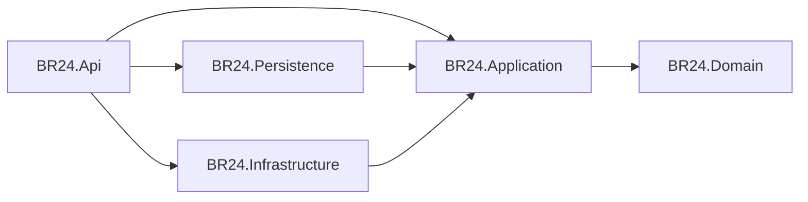

# Backend Documentation

**Solution:** `E:\WORKING_FOLDER\BR24\Backend\BR24_Backend\BR24.sln`  
**Target framework:** net7.0

## Projects and dependency flow

| Project | Responsibility |
|---------|----------------|
| `BR24.Api` | Controllers, `Program.cs`, middleware, `appsettings*.json`, static `Media` |
| `BR24.Application` | Features (Commands/Queries/BusinessLogic), `I*Service`, contracts, AutoMapper, FluentValidation |
| `BR24.Domain` | `Entities\` only (~960 `.cs` files) |
| `BR24.Persistence` | `ApplicationDbContext`, repositories, migrations, SP helpers |
| `BR24.Infrastructure` | Email (SMTP/SendGrid), logging, IdentityServer config, `ApiClient` |

## Controllers

Location: `BR24.Api/Controllers/` — **50** controller files.

Convention: `[Route("api/[controller]")]` + `[ApiController]`; most have `[Authorize]`.

| Controller | Notes |
|------------|-------|
| `LoginController` | JWT issuance, OTP, forgot password; mixed anonymous |
| `GlobalAPIController` | Route `api/1CD8AF55-D386-464F-B7B0-35C5D0A462FD` + GUID actions |
| `HomeController` | Empty shell |
| `SDE_ConfigurationController` | Empty shell |
| `WelcomeController` | Health/welcome |
| Others | Domain-named resources (`SalesOrder`, `ProcurementTender`, `Collection`, …) |

Full endpoint list: [api-catalog.md](./api-catalog.md).

## Services and business logic location

- Contracts: `BR24.Application/Contracts/Services/I*Service.cs`
- Implementations: `BR24.Application/Features/{Feature}/BusinessLogic/*Service.cs`
- Registration: `BR24.Application/Extensions/ApplicationServiceRegistration.cs` (`AddApplicationServices`)

**Feature folders (exact under `Features\`):** Account, Area, Bank, BiznessEvent(+ PC* variants), Brand, BRFeature, Buyer, BuyerWiseCommissionAchievement, ChainFlowChart, ChequeBook, Collection, Company, CostSheet, CostSheetDetail, CurrentStock, Department, District, Division, Dynamic, Employee, FixedTaskTemplate, GenerateEvent, GlobalApi, ImportIn, Location, Login, LPurchaseIn, Payment, PaymentMode, PreImportIn, ProcurementRequisition, ProcurementTender, Product, ProductGroup, Project, PurchaseReturn, Region, RegionMaster, ReportGeneration_Query, Reporting, SalesOrder, SalesReturn, SA_ChainMenu, SA_NextEvent, SDE_Configuration, SecretQuestion, SendEmail, Supplier, Target_BuyerProductGroup, Target_SPProductGroup, Team, UniversalEdit, Voucher.

Typical feature shape: `Commands\`, `Queries\`, `BusinessLogic\`.

## Repository / data access patterns

- Contracts: `BR24.Application/Contracts/Persistence/I*Repository.cs`, `IGenericRepository<>`, `IUnitOfWork`
- Implementations: `BR24.Persistence/Repositories/`
- DbContext: `BR24.Persistence/DbContexts/ApplicationDbContext.cs` (command timeout **7200** seconds)
- SP helper: `BR24.Persistence/ExtensionMethods/StoredProcedureExtension.cs`
- Registration: `AddPersistenceServices`

## Middleware

- `BR24.Api/Middleware/ExceptionMiddleware.cs` — maps application exceptions (e.g. `BadRequestException`, `NotFoundException`) to HTTP problem responses
- Serilog request logging after authorization
- CORS: allow any origin/method/header + credentials

## Dependency injection

| Extension | Registers |
|-----------|-----------|
| `AddApplicationServices()` | MediatR, AutoMapper, FluentValidation, feature services |
| `AddPersistenceServices(IConfiguration)` | DbContext, repositories, UnitOfWork |
| `AddInfrastructureServices(IConfiguration)` | Email, logging, IdentityServer-related services |

## Error handling

- Prefer throwing Application-layer exceptions caught by `ExceptionMiddleware`
- Controllers generally return DTOs / `Task<T>` rather than wrapping every call in try/catch
- Validation via FluentValidation (where configured on commands)

## Authentication

- Scheme: `JwtBearerDefaults.AuthenticationScheme`
- Config section: `Jwt` (`Key`, `Issuer`, `Audience`, `Subject`, `ExpireMinutes`)
- Claims include `UserId`, `UserName` (used in Serilog enrichment)
- IdentityServer4 packages/config exist but **are not mounted** via `UseIdentityServer()` in Api `Program.cs`

## Coding pattern for a new backend feature

1. Entity in `BR24.Domain/Entities` (+ `DbSet<>` in `ApplicationDbContext` if persisted)
2. `I*Repository` + `*Repository` + DI registration
3. Feature folder: Queries/Commands + DTOs under `Features/{Name}/`
4. `I*Service` + `*Service` + DI registration
5. Thin `*Controller` with `[Route("api/[controller]")]`
6. AutoMapper profile if mapping is non-trivial
7. Update FE `*ApiSlice` + docs/KG (see knowledge-maintenance.md)

## External integrations (backend)

- SMTP MailKit (`EmailSenderSmtp`)
- SendGrid sender class present but DI commented out
- SMS HTTP call for OTP
- Local file storage `Media`
- `GlobalAPIController` for external buyer/sales-order style integrations

## Packages noted but unused in runtime path

- Hangfire / Hangfire.SqlServer — referenced on Api, **not** registered in `Program.cs`
- FluentNHibernate — referenced on Domain; EF Core is the active ORM
