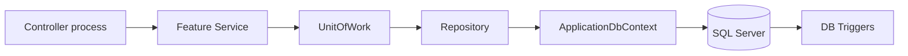

# Database Documentation

**ORM:** Entity Framework Core 7.0.13  
**Provider:** Microsoft.EntityFrameworkCore.SqlServer  
**DbContext:** `BR24.Persistence/DbContexts/ApplicationDbContext.cs`  
**Connection string key:** `ConnectionStrings:DefaultConnection` (SQL Server). Do not document password values.

## Scale

| Metric | Count (extraction time) |
|--------|-------------------------|
| Entity `.cs` files under `BR24.Domain/Entities` | ~960 |
| `DbSet<>` properties on `ApplicationDbContext` | ~857 |
| Named EF migrations | 3 + `ApplicationDbContextModelSnapshot` |
| `.sql` scripts in repo | **0** (SPs live in the database) |

Entity files without a matching `DbSet` may be orphaned or unused — mark usage **unknown** unless referenced in repositories/features.

## Relationship modeling

- Primary style: data annotations on entities (`[Table]`, `[ForeignKey]`, `[InverseProperty]`, `[Key]`)
- Fluent API: sparse. Notable `OnModelCreating` cascade graph for **BiznessEventProcessConfiguration → BiznessEvent_PCLocation → BiznessEvent_PCUser → user product/brand/group**
- Explicit EF configuration class found: `Configurations/BRFeatureConfiguration.cs`
- Full FK graph for all 857 sets: **not exhaustively documented in Fluent API** → treat undocumented FKs as **unknown** unless read from the entity file

## Naming prefixes (observed)

| Prefix | Meaning (from naming only) |
|--------|----------------------------|
| `temp_`, `tmp_`, `tmp` | Temporary / report scratch entities |
| `vw_`, `vw…` | View-style entities |
| No prefix | Ordinary tables/entities |

Do not invent business meanings beyond what names and code show.

## Important domain entity clusters (exact names)

### Security / org
`Company`, `Location`, related security user entities used by Login features (see Login/SecurityUser repositories).

### Workflow / chains
`BiznessEvent`, `BiznessEventProcessConfiguration`, `BiznessEvent_PCTrack`, `BiznessEvent_PCTrack_Attachment`, `BiznessEvent_PCLocation`, `BiznessEvent_PCUser`, `BiznessEvent_PCProductGroup`, `BiznessEventPC_Brand`, `BiznessEvent_PCPageButtonAccess`, `FixedTaskTemplate`, …

### Sales / finance
`SalesOrder` (+ detail/tax/additional cost entities as used by SalesOrder feature), `SalesReturn`, `Collection`, `Payment`, `ChequeBook` / cheque detail entities, `Voucher` (as used by Voucher feature/repos).

### Purchase / import / costing
`LPurchaseIn`, Import-In related entities, `CostSheet`, `CostSheetDetail`, `ProcurementTender`, `ProcurementTenderDetail`, `ProcurementTender_AdditionalCost`, `ProcurementTender_AdditionalCostDetail`, `ProcurementRequisition`, `ProcurementRequisitionDetail`, `ProcurementRequisitionDetailCS`.

### Targets / territory
`RegionMaster`, `Region`, `Division`, `District`, `Area`, `Target_SPProductGroup`, `Target_BuyerProductGroup`, `Team`, `Buyer`, `BuyerWiseCommissionAchievement`.

### Inventory
Current stock entities used by `CurrentStock` feature / `SP_GetCurrentStockPreview`.

## Foreign keys (examples evidenced)

From tender entities (annotations):

- `ProcurementTender` → table `ProcurementTender`; FK `CompanyId` → `Company`; key `ProcurementTenderId`
- `ProcurementTenderDetail` → `ProcurementTenderDetail`
- `ProcurementTender_AdditionalCost` / `ProcurementTender_AdditionalCostDetail` — FKs between additional cost and detail

Full inventory: open the specific entity file under `BR24.Domain/Entities/` or search `nodes.json` id `be:entity:{Name}`.

## Stored procedures referenced in code (exact)

| Stored procedure | Typical consumer area |
|------------------|----------------------|
| `SP_GetTenderAnalysisReport` | ProcurementTender / reporting |
| `SP_NextEvent_Fancy` | SA_NextEvent |
| `SP_NextEvent_For_SendEmail` | Email / next event |
| `SP_GetDynamicEventNo` | CustomQuery / Dynamic |
| `SP_GetDynamicReport_FrontendElements` | Dynamic reports |
| `SP_GetDynamicReport_ButtonElements` | Dynamic reports |
| `SP_GetDynamicReport_FrontendOptions` | Dynamic reports |
| `SP_DynamicReportDownloadQuery` | Dynamic report download |
| `SP_PermissionWiseUserProductGroupBrandAndProduct` | CustomQuery |
| `SP_GetMonthlyIncentiveReport` | Reporting |
| `SP_GetProductGroupWiseMonthlySalesAndTargetReport` | Reporting |
| `SP_GetProductGroupWiseMonthlyTargetAndAchievementReport` | Reporting |
| `SP_GetProductGroupWiseDailySalesReport` | Reporting |
| `SP_GetProductGroupMpoWiseDailySalesReport` | Reporting |
| `SP_GetCurrentStockPreview` | CurrentStock |
| `SP_GetBuyerWiseCommissionAchievement` | Commission |
| `SP_GetBuyerSalesReport` | Buyer |
| `SP_Buyer_CurrentFinancial` | Buyer |
| `SP_GetTransactionNameWithCostingAmount` | BiznessEvent_PCTrack / costing |
| `SP_GetVoucherByTransactionName` | BiznessEvent_PCTrack |

Commented reference observed: `SP_NextEvent_Speed_Up` (not active unless uncommented).

Invocation path: repositories/services → `CallStoredProcedure` / `CallStoredProcedureSingleAsync` / `ExecuteSqlRawAsync`.

## SQL Server triggers wired in EF

- `TR_AUTO_SETTLEMENT_When_Collection_Approved`
- `TR_AUTO_SETTLEMENT_When_OpeningBalance`
- `TR_AUTO_SETTLEMENT_When_SalesReturn_Approved`
- `TR_AUTO_SETTLEMENT_When_SalesOrder_Update`

## Migrations

Under `BR24.Persistence/Migrations/`:

- `20231120111230_InitialMigration`
- `20231123095733_CreateLogGeneration`
- `20231210074409_CreateNineTableAndAlterVoucherAgainstVoucher`
- `ApplicationDbContextModelSnapshot.cs`

Schema for many legacy tables/SPs is assumed to exist in the target database beyond these migrations.

## Data flow (typical write)

## Repositories

See `BR24.Persistence/Repositories/` and contracts under `BR24.Application/Contracts/Persistence/`. Knowledge graph nodes use ids `be:repository:{Name}`.
