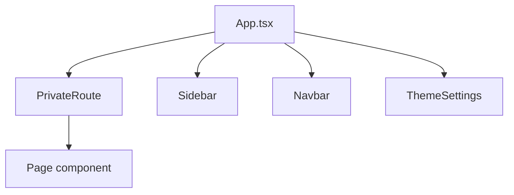

# Frontend Documentation

**Root:** `E:\WORKING_FOLDER\BR24\Frontend\BR24 Frontend`  
**Package name:** `react-vite-ts`

## Application structure

Clean-Architecture-style folders (presentation-heavy; domain is interfaces only):

| Folder | Purpose |
|--------|---------|
| `src/presentation/` | Pages, components, `mainFiles` (`App.tsx`, `main.tsx`, `PrivateRoute.tsx`) |
| `src/application/Redux/` | Redux Toolkit store + UI/feature slices |
| `src/domain/interfaces/` | TypeScript DTOs/interfaces (`I*`) |
| `src/infrastructure/api/` | RTK Query `*ApiSlice.ts` |
| `src/infrastructure/Auth/JWTSecurity/` | `jwtTokenManager.ts` |
| `src/Configs/` | Duplicate `apiConfig.json` |
| `public/apiConfig.json` | Runtime config loaded by `index.html` |
| `src/presentation/hooks/` | Present but empty at docs time |
| `src/infrastructure/thirdPartyApi/` | Empty |

**Entry:** `index.html` → `src/presentation/mainFiles/main.tsx` → Redux `Provider` → `App.tsx`.

## Technology

- React 18, TypeScript, Vite 4 (`@vitejs/plugin-react-swc`)
- UI: MUI 5, Emotion, Tailwind 3, material-react-table, react-icons, sweetalert2, react-toastify
- State/HTTP: Redux Toolkit + RTK Query; axios for some calls
- Forms/dates: react-hook-form, dayjs
- Charts/flow: chart.js, @xyflow/react
- Excel: exceljs, xlsx, export-to-csv
- Lint: ESLint Airbnb + Prettier

## Routing

Defined only in `src/presentation/mainFiles/App.tsx` (no separate router module).

**Guard:** `PrivateRoute` — if `localStorage.userInfo` falsy → navigate to `/loginUsername`; stores intended path via `LastRouteSlice`.

### Representative static routes

| Path | Page component |
|------|----------------|
| `/`, `dashboard` | `Dashboard` |
| `loginUsername`, `loginPassword`, `loginPhoneLayer`, `loginOtpLayer` | Login layers |
| `forgotPasswordCompanyLocationSelect`, `secretQuestion`, `resetPassword` | Password recovery |
| `costSheetDetail` | `CostSheetDetail` |
| `chequeBookManagement` | `ChequeBookRegistration` |
| `chainConfiguration` | `ChainConfiguration` |
| `teamAndTarget`, `teamTreeNew`, `teamTreeTest` | Team/target pages |
| `regionTree`, `regionBuyerTree` | Region/buyer targets |
| `tenderRequisition`, `tenderWonStatic`, `tenderCosting` | Tender flows |
| `salesOrderEdit`, `salesOrderTracking`, `salesOrderSummary`, `pointOfSales` | Sales |
| `lPurchaseInEdit`, `purchaseReturnEdit`, `importInEdit` | Purchase/import |
| `collectionEdit`, `paymentEdit`, `salesReturnEdit` | Finance edits |
| `*Import` under DataImportPages | Bulk import |
| `currentStockPreview` | Stock |
| `buyerSalesReport`, `incentiveReport`, `dailySalesReport` | Reports |
| `commissionManagement` | Commission |
| `reactFlowExp`, `reactFlowExp2` | Flow experiments / BR2 links |

**Dynamic routes:** `useGetSAChainMenuByCompanyLocationUserIdQuery` builds paths from `fixedTaskTemplateName` (spaces removed) → `EventsOfAChain` or `DynamicReportAnalysis`. Exact path strings are **server-driven / unknown at build time**.

### PrivateRoute audit (Phase 5)

**Intentionally public (login/reset):** `loginUsername`, `loginPassword`, `loginPhoneLayer`, `loginOtpLayer`, `forgotPasswordCompanyLocationSelect`, `secretQuestion`, `resetPassword`.

**Guarded in Phase 5 (were unprotected business pages):** `tenderCosting`, edit pages (`salesOrderEdit`, `lPurchaseInEdit`, `purchaseReturnEdit`, `paymentEdit`, `collectionEdit`, `collectionEditGh`, `salesReturnEdit`, `importInEdit`), additional-cost pages, import pages (`*Import`), `salesOrderTracking`, `currentStockPreview`, `salesOrderSummary`, `pointOfSales`, `sample`.

**Still review later (commented or special):** commented `bizEventProcConfig` / `structuredPage` samples; dynamic chain template routes already use `PrivateRoute` in active branches.

## Component hierarchy (shell)



Shared UI under `src/presentation/components/` including `biz24Components/` (e.g. DualListSelector variants).

## State management

- **No** Zustand / app-wide React Context for auth.
- Redux store: `src/application/Redux/store/store.ts`
- UI slices: theme, sidebar, screen size, last route, team/region/buyer modal slices, etc.
- Server state: RTK Query APIs registered as reducers + middleware in `store.ts`.

**Orphans on disk (not registered in store at docs time):** `BuyerGroupApiSlice`, `LCVouchersForTransactionsApiSlice` — usage unknown without further call-site search.

## API communication layer

Pattern (legacy — still most slices):

```ts
const API_BASE_URL = window.API_BASE_URL;
const controllerName = 'SalesOrder'; // example
createApi({
  baseQuery: fetchBaseQuery({
    baseUrl: `${API_BASE_URL}/${controllerName}/`,
    prepareHeaders: (headers) => { /* Bearer getToken() */ },
  }),
});
```

**Phase 5 preferred helper:** `src/infrastructure/api/shared/createAuthenticatedBaseQuery.ts`

```ts
baseQuery: createAuthenticatedBaseQuery(controllerName),
```

**Migrated pilots:** `TenderApiSlice`, `BuyerApiSlice`. New/refactored slices should use the helper; bulk migrate remaining slices incrementally.

### Slice → controller map (exact)

| ApiSlice file | controllerName |
|---------------|----------------|
| AccountsNameApiSlice | Account |
| AreaApiSlice | Area |
| BiznessEventApiSlice | BiznessEvent |
| BiznessEventPCTrackVMForJobHistoryApiSlice | BiznessEvent_PCTrack |
| BiznessEventPCTrackVMForTRLogApiSlice | BiznessEvent_PCTrack |
| BiznessEventProcessConigurationApiSlice | BiznessEventProcessConfiguration |
| BuyerApiSlice | Buyer |
| ChequeBookApiSlice | ChequeBook |
| CollectionApiSlice | Collection |
| CommissionApiSlice | BuyerWiseCommissionAchievement |
| CostSheetDetailApiSlice | CostSheetDetail |
| CostSheetLCNoApiSlice | CostSheet |
| CurrentStockApiSlice | CurrentStock |
| DataMigrationApiSlice | DataMigration |
| DepartmentApiSlice | Department |
| DistrictApiSlice | District |
| DivisionApiSlice | Division |
| DynamicApiSlice | CustomQuery |
| EmailApiSlice | Email |
| EmployeeApiSlice | Employee |
| EventVouchersForTransactionsApiSlice | BiznessEvent_PCTrack |
| FixedTaskTemplateApiSlice | FixedTaskTemplate |
| GetBanksForChequeBookApiSlice | Bank |
| ImportInApiSlice | ImportIn |
| LCVouchersForTransactionsApiSlice | BiznessEvent_PCTrack |
| LocationApiSlice | Location |
| LoginApiSlice | Login |
| LPurchaseInApiSlice | LPurchaseIn |
| PaymentApiSlice | Payment |
| PaymentModeApiSlice | PaymentMode |
| PreImportInApiSlice | PreImportIn |
| ProcurementRequisitionApiSlice | ProcurementRequisition |
| ProductApiSlice | Product |
| PurchaseReturnApiSlice | PurchaseReturn |
| RegionApiSlice | Region |
| RegionMasterApiSlice | RegionMaster |
| ReportingApiSlice | Reporting |
| SAChainMenuApiSlice | SA_ChainMenu |
| SANextEventApiSlice | SA_NextEvent |
| SalesOrderApiSlice | SalesOrder |
| SalesReturnApiSlice | SalesReturn |
| SecurityUserApiSlice | Login |
| SupplierApiSlice | Supplier |
| TargetBuyerProductGroupApiSlice | Target_BuyerProductGroup |
| TargetSPProductGroupApiSlice | Target_SPProductGroup |
| TeamAndTeamDetailApiSlice | Team |
| TenderApiSlice | ProcurementTender |
| TransactionAndCostingAmountApiSlice | BiznessEvent_PCTrack |

`SalesOrderTrackingApiSlice` uses root `API_BASE_URL/` with full relative paths like `SalesOrder/getSalesOrderTracking`.

Common mutation URL: `'process'`.

## Shared utilities / patterns

- `src/presentation/Utils/` — shared helpers
- `cacheBusterFunct` — cache busting wrapper around app
- Toast (`react-toastify`), SweetAlert2 dialogs
- Dark mode via Tailwind `dark` class + theme Redux slices
- Many backup/`copy`/`Golden` page variants kept alongside live files — prefer the route-wired component in `App.tsx`

## Page modules (business)

See folders under `src/presentation/pages/` — e.g. `Login`, `DashBoard`, `EventsOfAChain`, `ChainConfiguration`, `TenderRequisition`, `TenderCosting`, `TenderWon`, `SalesOrderEdit`, `CollectionEdit`, `PaymentEdit`, `TeamAndTarget`, `RegionAndTarget`, `BuyerAndTarget`, `CommissionManagement`, `DataImportPages`, `DynamicReportAnalysis`, `CurrentStockPreview`, etc.
