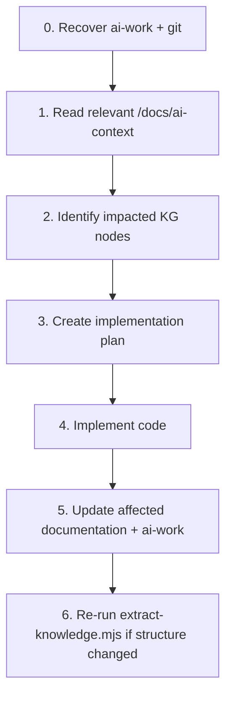

# Knowledge Maintenance

Every future AI coding task on BR24 must follow this workflow.

**Full agent operating contract:** [ai-development-guidelines.md](./ai-development-guidelines.md) (includes Graphify usage, impact analysis, API/DB safety, **§13 continuity**).  
**Graphify location:** `docs/knowledge-graph/` (`nodes.json`, `relationships.json`).  
**Work-state:** `docs/ai-work/` (`ACTIVE.md`, `SESSION_CHECKPOINT.md`, `history/`).  
**Agent entry:** root `AGENTS.md`.

## Mandatory workflow



1. **Recover** (new session): `AGENTS.md` → `docs/ai-work/ACTIVE.md` + `SESSION_CHECKPOINT.md` + relevant history (guidelines §13.3).
2. **Read** `docs/ai-context/README.md` plus area docs (`frontend.md`, `backend.md`, `database.md`, `api-catalog.md`, `business-domain.md`).
3. **Identify** impacted nodes in `docs/knowledge-graph/nodes.json` and edges in `relationships.json` (by id prefix: `fe:page:`, `fe:api:`, `be:controller:`, `be:feature:`, `be:entity:`, `be:repository:`).
4. **Plan** the change using exact project names; open/update `ACTIVE.md` for significant work.
5. **Implement**.
6. **Update documentation** for anything that changed (see checklist below) and checkpoint `docs/ai-work/`.
7. **Re-extract** the knowledge graph when folders, controllers, entities, or API slices were added/removed/renamed.

## What to update when

| Change type | Update these |
|-------------|--------------|
| New/changed HTTP endpoint | `api-catalog.md`; re-run extractor; relationships FE slice ↔ controller |
| New FE page or route | `frontend.md` routes section; KG page node |
| New/changed RTK slice | `frontend.md` slice→controller table; KG `fe:api:*` |
| New Application Feature / service / repo | `backend.md`; KG feature/service/repository nodes |
| New/changed entity or DbSet | `database.md`; KG entity + `maps_to` edges |
| New SP / trigger reference | `database.md` SP/trigger lists |
| Auth / pipeline / DI change | `system-architecture.md`, `backend.md` |
| Business workflow change | `business-domain.md` |
| Coding convention change | `ai-development-guidelines.md` |
| Significant / multi-step AI task | `docs/ai-work/ACTIVE.md`, `SESSION_CHECKPOINT.md`, `history/TASK-*.md` |
| Lasting architecture decision | `docs/adr/NNNN-*.md` (+ link from task history) |
| Stack version change (npm/dotnet) | `README.md` stack snapshot, `frontend.md` / `backend.md` tech sections |

## Re-running extraction

From the frontend repo root (or via node path):

```bash
node docs/scripts/extract-knowledge.mjs
```

This regenerates:

- `docs/knowledge-graph/nodes.json`
- `docs/knowledge-graph/relationships.json`
- `docs/knowledge-graph/extraction-meta.json`
- `docs/ai-context/api-catalog.md` (table regenerated — merge any hand-written narrative if needed)

**Does not modify** application `src/` or Backend source.

## Hand-maintained vs generated

| Artifact | Maintained how |
|----------|----------------|
| `nodes.json` / `relationships.json` / `api-catalog.md` | Prefer extractor |
| `system-architecture.md`, `frontend.md`, `backend.md`, `database.md`, `business-domain.md`, guidelines, maintenance | Hand-updated; keep names exact |
| `docs/ai-work/*`, `docs/adr/*` | Hand-updated work-state / decisions (not generated) |
| `docs/architecture/*.md` | Hand-updated Mermaid |

After extraction, spot-check that new controllers/pages appear. Fix extractor filters if something is missing rather than inventing nodes by hand.

## Secrets policy

Never copy connection strings, JWT keys, SMTP passwords, or SendGrid API keys into `/docs`. Document **setting names** only.

## Deferred / residual after Phase 5

Phase 5 (2026-09-28) applied controlled FE dependency upgrades (no Vite/React/MUI major), scoped UI polish, shared `createAuthenticatedBaseQuery` pilots, and PrivateRoute on clear business routes.

**Remaining known npm issues (not force-fixed):** Vite/esbuild (needs Vite major), react-router residual (needs v7), uuid via exceljs, `xlsx` (no upstream fix), typescript-eslint/minimatch (eslint 8 stack). Revisit in a dedicated major-upgrade task.

When majors land, update stack versions in docs and re-extract Graphify if structure changes.
