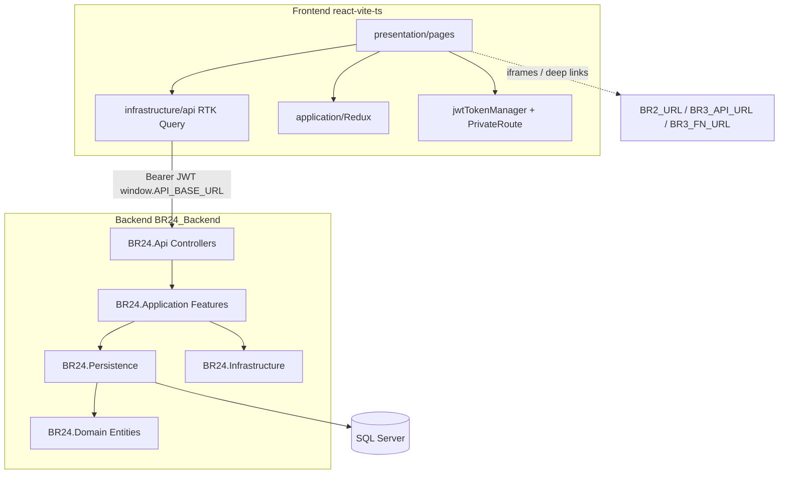
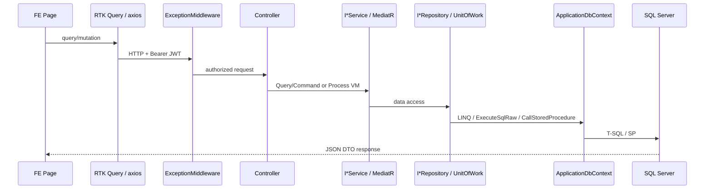

# System Architecture

## Overview

BR24 (**Bizness Roots / Bizroots-24**) is a business ERP-style web application:

- **Frontend:** React + TypeScript SPA (`react-vite-ts`) served statically (IIS/`web.config`, Netlify-style `_redirects`).
- **Backend:** ASP.NET Core 7 Web API (`BR24.Api`) using Clean Architecture.
- **Database:** Microsoft SQL Server via EF Core `ApplicationDbContext` (`ConnectionStrings:DefaultConnection`).

## Frontend → backend communication

1. At load, `index.html` sync-fetches `/apiConfig.json` and sets:
   - `window.API_BASE_URL` (primary BR24 API; includes `/api`)
   - `window.BR2_URL`, `window.BR3_API_URL`, `window.BR3_FN_URL` (legacy)
2. Most data access uses RTK Query slices under `src/infrastructure/api/*ApiSlice.ts` with `fetchBaseQuery({ baseUrl: \`${API_BASE_URL}/${controllerName}/\` })`.
3. `prepareHeaders` typically adds `Authorization: Bearer ${getToken()}`.
4. Some screens use **axios** directly (notably Login and selected reports/edits).
5. Controller names on the FE map to ASP.NET `[Route("api/[controller]")]` resources (e.g. `TenderApiSlice` → `ProcurementTender`).

## API request lifecycle

### Backend pipeline (`BR24.Api/Program.cs`)

Order (exact):

1. `UseForwardedHeaders`
2. `UseSession`
3. `ExceptionMiddleware`
4. Swagger (if `Swagger:Enabled`)
5. CORS (any origin/method/header + credentials)
6. `UseHttpsRedirection`
7. `UseAuthentication` / `UseAuthorization` (JWT Bearer)
8. Serilog request logging (enriches UserId / UserName / IP)
9. Static files under `/Media`
10. `MapControllers`

DI registration: `AddApplicationServices()`, `AddInfrastructureServices()`, `AddPersistenceServices()`.

## Backend processing flow

- Controllers are thin; most call `I*Service` implementations under `BR24.Application/Features/{Feature}/BusinessLogic/`.
- Features use MediatR **Commands** / **Queries** (+ DTOs).
- Composite writes often use `POST .../process` with a Commands VM bundling create/update/delete lists (e.g. `SalesOrderCommandsVM`, `ProcurementTenderCommandsVM`).
- Side effects: email (`SendEmail` / `EmailController`), SMS OTP (HTTP to `Company.SmsApi`), file attachments under `Media`.

## Database interaction flow

- Repositories implement `BR24.Application/Contracts/Persistence/I*Repository`.
- `UnitOfWork` coordinates saves.
- EF Core maps ~857 `DbSet<>` properties; ~960 entity class files exist (some may be unmapped — treat unmapped as unknown usage).
- Stored procedures invoked via `StoredProcedureExtension.CallStoredProcedure*` and raw SQL.
- EF-wired SQL triggers for auto-settlement (Collection / OpeningBalance / SalesReturn / SalesOrder).

## External service communication

| Integration | Implementation | Status |
|-------------|----------------|--------|
| SMTP email | `EmailSenderSmtp` + `SmtpSettings` | Active |
| SendGrid | `EmailSender` + `EmailSettings` | Present; DI commented out |
| SMS OTP | `GenerateOtpCommandHandler` + company SMS URL | Active |
| Local media | `/Media` static files | Active |
| Legacy BR2/BR3 | FE `window.BR2_URL` / `BR3_*` | Used for deep links / iframes |
| Global third-party API | `GlobalAPIController` GUID routes | Active |
| Hangfire | Package referenced | **Not registered in Program.cs** (unused at runtime) |
| IdentityServer4 | Configured in Infrastructure | **`UseIdentityServer()` not in Api pipeline**; JWT is primary |

## Authentication mechanism

**Backend:** JWT Bearer (`Jwt:Key`, `Jwt:Issuer`, `Jwt:Audience`, `Jwt:ExpireMinutes`). Tokens issued by `LoginController` / `GlobalAPIController`.

**Frontend:** Login layers store session in `localStorage.userInfo` including `userToken`. `PrivateRoute` redirects unauthenticated users to `/loginUsername`. Token expiry checked via `jwt-decode` in `jwtTokenManager.ts` (refresh path commented out).

## Build and deployment structure

| Side | Build | Deploy hints |
|------|-------|--------------|
| FE | `npm run dev` / `npm run build` (tsc + vite) | `public/web.config`, `public/_redirects` |
| BE | `dotnet build` on `BR24.sln` | ASP.NET Core host; Swagger at `/swagger` when enabled |

## Solution projects (exact)

| Project | Role |
|---------|------|
| `BR24.Api` | HTTP host |
| `BR24.Application` | Features, services, contracts |
| `BR24.Domain` | Entities |
| `BR24.Persistence` | EF, repositories, migrations |
| `BR24.Infrastructure` | Email, logging, IdentityServer config, ApiClient |

`quickstart/src/IdentityServer` exists on disk but is **not** in `BR24.sln`.
