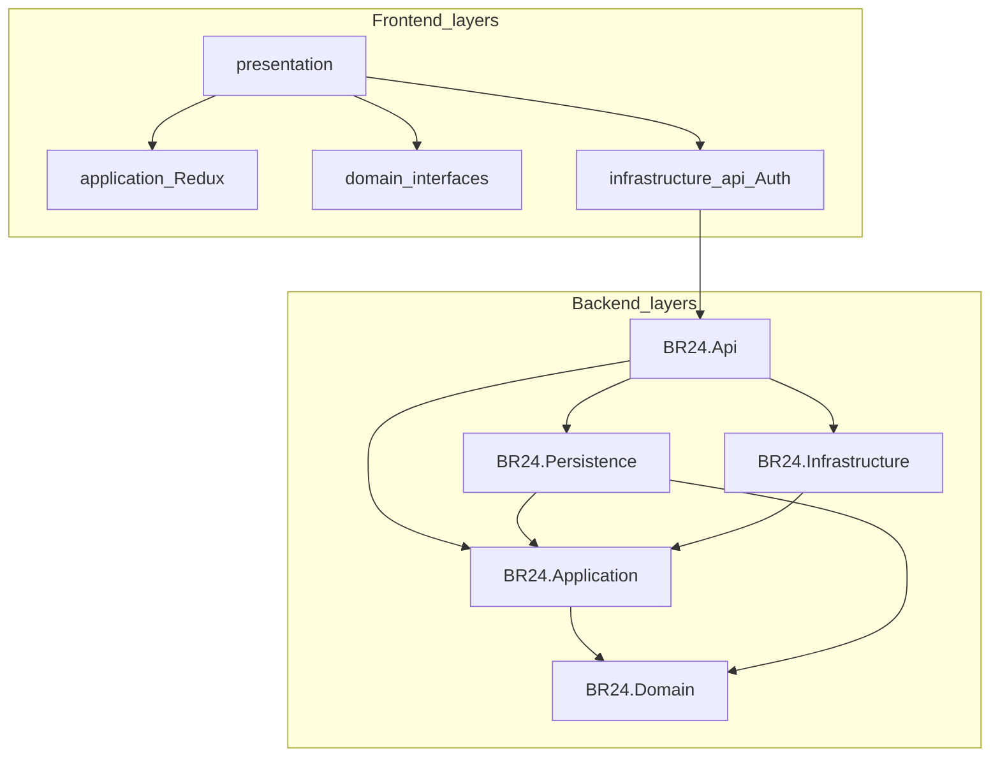
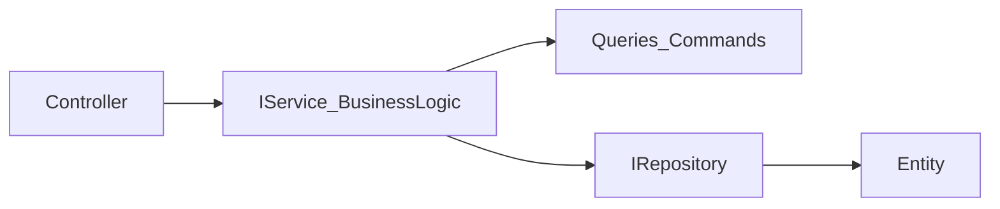

# Application Layers Diagram

```mermaid
flowchart TB
  subgraph feLayers [Frontend_layers]
    P[presentation]
    A[application_Redux]
    D[domain_interfaces]
    I[infrastructure_api_Auth]
  end
  subgraph beLayers [Backend_layers]
    Api[BR24.Api]
    App[BR24.Application]
    Dom[BR24.Domain]
    Per[BR24.Persistence]
    Inf[BR24.Infrastructure]
  end
  P --> A
  P --> I
  P --> D
  I --> Api
  Api --> App
  App --> Dom
  Per --> App
  Per --> Dom
  Inf --> App
  Api --> Per
  Api --> Inf
```

## Backend feature slice (vertical)

```mermaid
flowchart LR
  C[Controller]
  S[IService_BusinessLogic]
  Q[Queries_Commands]
  R[IRepository]
  E[Entity]
  C --> S
  S --> Q
  S --> R
  R --> E
```
