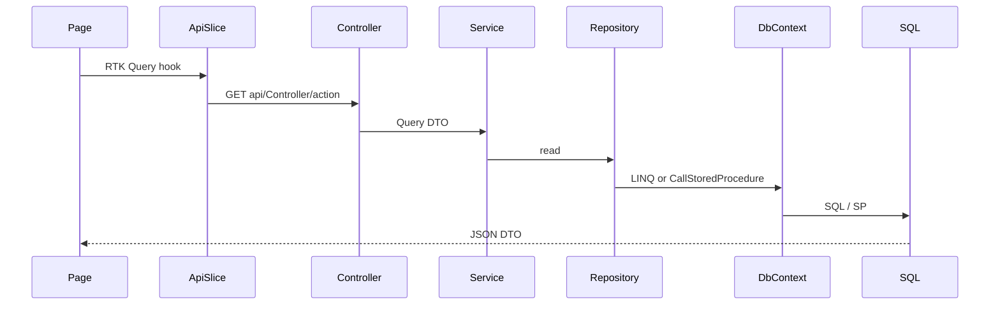
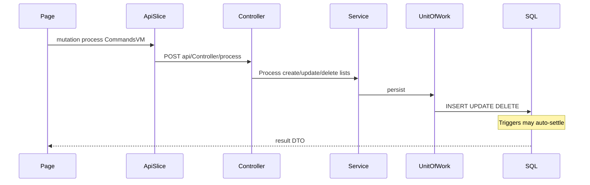
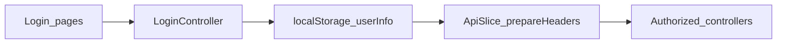

# Data Flow Diagram

## Read path (typical GET)

```mermaid
sequenceDiagram
  participant Page
  participant ApiSlice
  participant Controller
  participant Service
  participant Repository
  participant DbContext
  participant SQL
  Page->>ApiSlice: RTK Query hook
  ApiSlice->>Controller: GET api/Controller/action
  Controller->>Service: Query DTO
  Service->>Repository: read
  Repository->>DbContext: LINQ or CallStoredProcedure
  DbContext->>SQL: SQL / SP
  SQL-->>Page: JSON DTO
```

## Write path (typical process POST)

```mermaid
sequenceDiagram
  participant Page
  participant ApiSlice
  participant Controller
  participant Service
  participant UoW as UnitOfWork
  participant SQL
  Page->>ApiSlice: mutation process CommandsVM
  ApiSlice->>Controller: POST api/Controller/process
  Controller->>Service: Process create/update/delete lists
  Service->>UoW: persist
  UoW->>SQL: INSERT UPDATE DELETE
  Note over SQL: Triggers may auto-settle
  SQL-->>Page: result DTO
```

## Auth token flow

```mermaid
flowchart LR
  LoginUI[Login_pages]
  LoginAPI[LoginController]
  LS[localStorage_userInfo]
  RTK[ApiSlice_prepareHeaders]
  API[Authorized_controllers]
  LoginUI --> LoginAPI
  LoginAPI --> LS
  LS --> RTK
  RTK --> API
```
