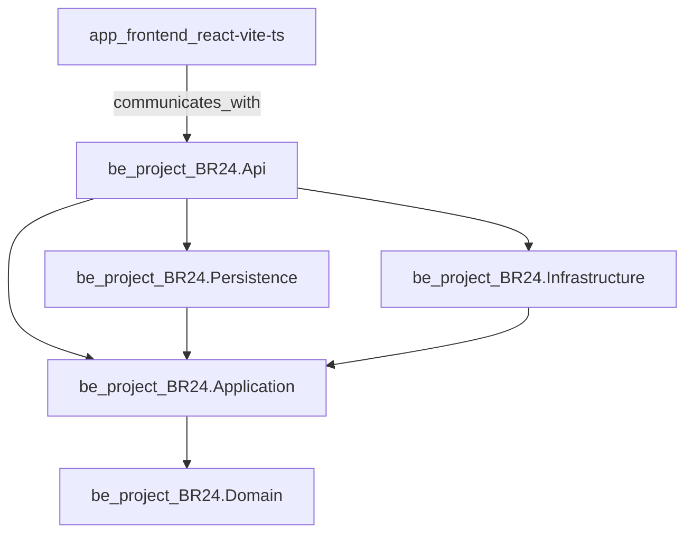
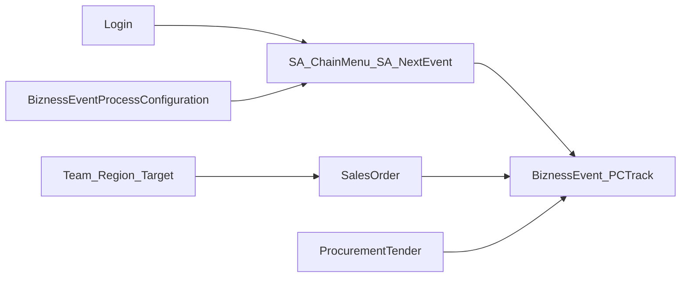

# Module Dependency Diagram

High-level dependencies between solution projects and major FE modules. Exact edges also live in `../knowledge-graph/relationships.json`.

## Selected business module dependencies

