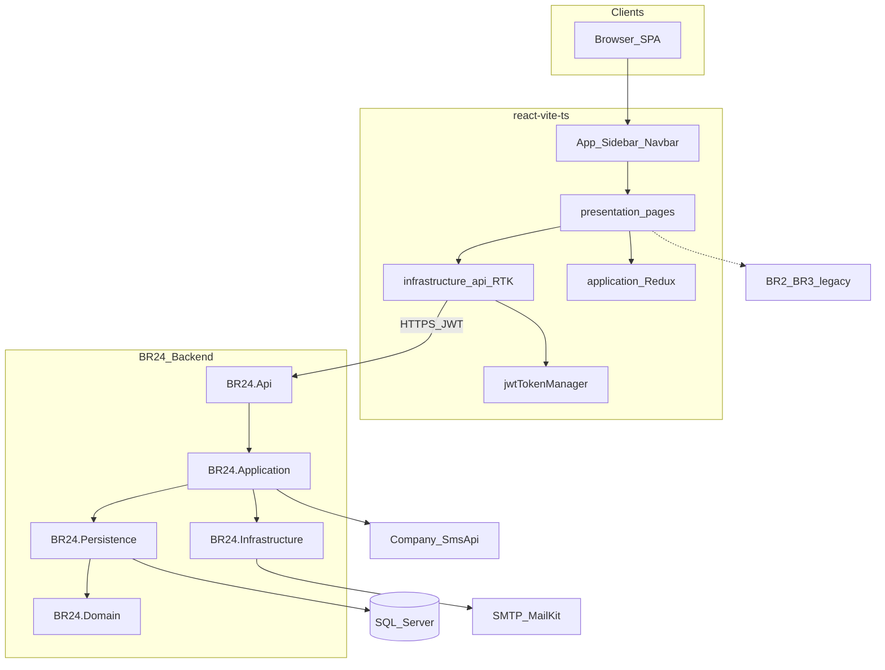

# System Architecture Diagram

See also narrative: [../ai-context/system-architecture.md](../ai-context/system-architecture.md)

```mermaid
flowchart TB
  subgraph clients [Clients]
    Browser[Browser_SPA]
  end
  subgraph frontend [react-vite-ts]
    AppShell[App_Sidebar_Navbar]
    Pages[presentation_pages]
    RTK[infrastructure_api_RTK]
    Redux[application_Redux]
    JwtFE[jwtTokenManager]
  end
  subgraph backend [BR24_Backend]
    Api[BR24.Api]
    App[BR24.Application]
    Persist[BR24.Persistence]
    Domain[BR24.Domain]
    Infra[BR24.Infrastructure]
  end
  SQL[(SQL_Server)]
  SMTP[SMTP_MailKit]
  SMS[Company_SmsApi]
  Legacy[BR2_BR3_legacy]
  Browser --> AppShell
  AppShell --> Pages
  Pages --> RTK
  Pages --> Redux
  RTK --> JwtFE
  RTK -->|"HTTPS_JWT"| Api
  Api --> App
  App --> Persist
  Persist --> Domain
  Persist --> SQL
  App --> Infra
  Infra --> SMTP
  App --> SMS
  Pages -.-> Legacy
```
