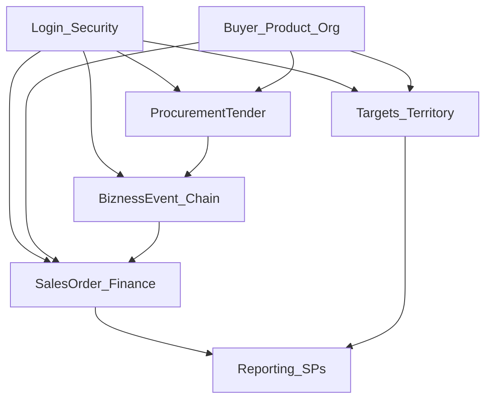

# Business Domain Knowledge Graph

Entities and modules below are taken from the codebase only. Relationships describe evidenced dependencies (controllers, commands, features, pages). Do not invent entities.

## Business modules

| Module | Frontend pages (examples) | Backend Feature / Controllers |
|--------|---------------------------|-------------------------------|
| Authentication & security | `Login/*` | `Login`, `SecretQuestion`, `Company`, `Location`, `SecurityUser` repos |
| Chain / workflow configuration | `ChainConfiguration`, `BiznessEventProcessConfiguration`, `EventsOfAChain` | `BiznessEventProcessConfiguration`, `FixedTaskTemplate`, `SA_ChainMenu`, `SA_NextEvent`, `BiznessEvent_PCTrack` |
| Sales orders | `SalesOrderEdit`, `PointOfSales`, `SalesOrderTracking`, `SalesOrderSummary`, `SalesAdditionalCost` | `SalesOrder` |
| Sales returns | `SalesReturnEdit` | `SalesReturn` |
| Collections & payments | `CollectionEdit`, `PaymentEdit` | `Collection`, `Payment`, `PaymentMode` |
| Cheque books | `ChequeBookRegistration` | `ChequeBook`, `Bank` |
| Local purchase | `LPurchaseInEdit`, `LPurchaseInAdditionalCost` | `LPurchaseIn` |
| Import-in / LC costing | `ImportInEdit`, `CostSheetDetail` | `ImportIn`, `PreImportIn`, `CostSheet`, `CostSheetDetail` |
| Procurement tenders | `TenderRequisition`, `TenderWon`, `TenderCosting`, `PurchaseComparativeSheet` | `ProcurementTender`, `ProcurementRequisition` |
| Targets (team / region / buyer) | `TeamAndTarget`, `RegionAndTarget`, `BuyerAndTarget` | `Team`, `RegionMaster`, `Region`, `Division`, `District`, `Area`, `Target_SPProductGroup`, `Target_BuyerProductGroup` |
| Commission | `CommissionManagement` | `BuyerWiseCommissionAchievement` |
| Buyers / suppliers / products | used across edits/reports | `Buyer`, `Supplier`, `Product`, `ProductGroup`, `Brand`, `Employee`, `Department` |
| Reporting | `BuyerSalesReport`, `IncentiveReport`, `DailySalesReport`, `DynamicReportAnalysis`, `TaskReporting` | `Reporting`, `CustomQuery` / `Dynamic`, `Buyer` report endpoints |
| Stock | `CurrentStockPreview` | `CurrentStock` |
| Data import | `DataImportPages/*` | Related process endpoints + `DataMigration` slice (controller presence verify in API) |
| Email notifications | (from next-event flows) | `SendEmail`, `EmailController` |
| Third-party integration | unknown FE dedicated page | `GlobalAPIController` |
| Feature flags / BR features | unknown dedicated page | `BRFeature` |
| Universal edit | unknown | `UniversalEdit` |

## Core workflows

### Login
`LoginUsernameLayer` / `LoginPasswordLayer` (or phone OTP) → `LoginController` (`isUserExist`, `login`, `request-otp`, `verify-otp`, company/location selection) → JWT stored in `localStorage.userInfo` → `PrivateRoute` allows app shell → `SA_ChainMenu` loads permitted chains/menus.

### Business event chain
`FixedTaskTemplate` defines a chain → `BiznessEventProcessConfiguration` configures steps, users, locations, product groups, brands, buttons → `SA_ChainMenu` / `SA_NextEvent` surface work → `EventsOfAChain` / `BiznessEvent_PCTrack.process` advances tracking and attachments → optional `Email` send to next-event user.

### Sales order
UI edit pages → `SalesOrderController.process` with `SalesOrderCommandsVM` → `SalesOrderService` → repositories → may create `BiznessEvent_PCTrack` via `CreateBiznessEventPCTrackCommand` → DB triggers may auto-settle on update/approval paths.

### Tender & costing
`TenderRequisition` / related UI → `ProcurementTenderController` (`process`, history, analysis) → `TenderCosting` page → `getTenderCosting` / `processTenderCosting` → `ProcurementTender` feature costing commands → tender won updates via `updateProcurementTenderOnlyTenderWonAndRemarks`.

### Targets
Geo hierarchy `RegionMaster` → `Region` → `Division` → `District` → `Area` → buyer or salesperson product-group targets (`Target_BuyerProductGroup`, `Target_SPProductGroup`) managed from Team/Region/Buyer target pages → `process` endpoints.

## Important entity relationships (phrased)

Format: **Entity A** relationship **Entity B**

- `Company` scopes `Location`
- `Company` owns `Buyer` / `Supplier` / `Product` / `Bank` (company-scoped queries)
- `FixedTaskTemplate` configures `BiznessEventProcessConfiguration`
- `BiznessEventProcessConfiguration` assigns `BiznessEvent_PCLocation` / `BiznessEvent_PCUser` / product-group and brand permissions
- `BiznessEvent_PCTrack` tracks execution of a chain instance (`FirstEventNo` / event numbers)
- `SalesOrder` process creates or updates related detail/tax/additional-cost commands and may create `BiznessEvent_PCTrack`
- `ProcurementTender` contains `ProcurementTenderDetail`
- `ProcurementTender` has `ProcurementTender_AdditionalCost` / `ProcurementTender_AdditionalCostDetail`
- `ProcurementTender` belongs to `Company` (`CompanyId`)
- `ProcurementRequisition` feeds comparative sheet / purchase flows (`ProcurementRequisitionController`)
- `Collection` / `Payment` process cheque detail information (`getChequeDetailInfo` / `getChequeDetailPaymentInfo`)
- `ChequeBook` relates to `Bank` (leaf/book APIs)
- `RegionMaster` parents `Region` hierarchy used by target modules
- `Target_SPProductGroup` targets salesperson × product group by team/month/year
- `Target_BuyerProductGroup` targets buyer × product group by area/month/year
- `BuyerWiseCommissionAchievement` process updates commission achievement data
- `CostSheet` / `CostSheetDetail` relate to LC costing (`getAllLCNo`)
- `Reporting` / `CustomQuery` read via stored procedures (`SP_Get*`, `SP_DynamicReport*`)
- `CurrentStock` preview reads via `SP_GetCurrentStockPreview`
- Auto-settlement **triggers** affect settlement when Collection / SalesReturn / SalesOrder / OpeningBalance events occur

## Cross-module dependencies

- **Login/Security** enables access to all modules via JWT + menu permissions.
- **Masters** (Buyer, Product, Employee, Company, Location) feed transactional modules.
- **BiznessEvent chain** wraps many transactional vouchers (`BiznessEvent_PCTrack`).
- **Reporting** depends on transactional and target data via stored procedures.

## Unknowns

- Exact full business rules inside each `*Service.Process` method — read the specific Feature BusinessLogic file.
- Whether every `temp_*` / `vw_*` entity is still used in production — unknown without DB usage analysis.
- `DataMigration` controller existence vs FE `DataMigrationApiSlice` — verify before extending.
- Empty controllers `HomeController`, `SDE_ConfigurationController` — no active HTTP surface.
