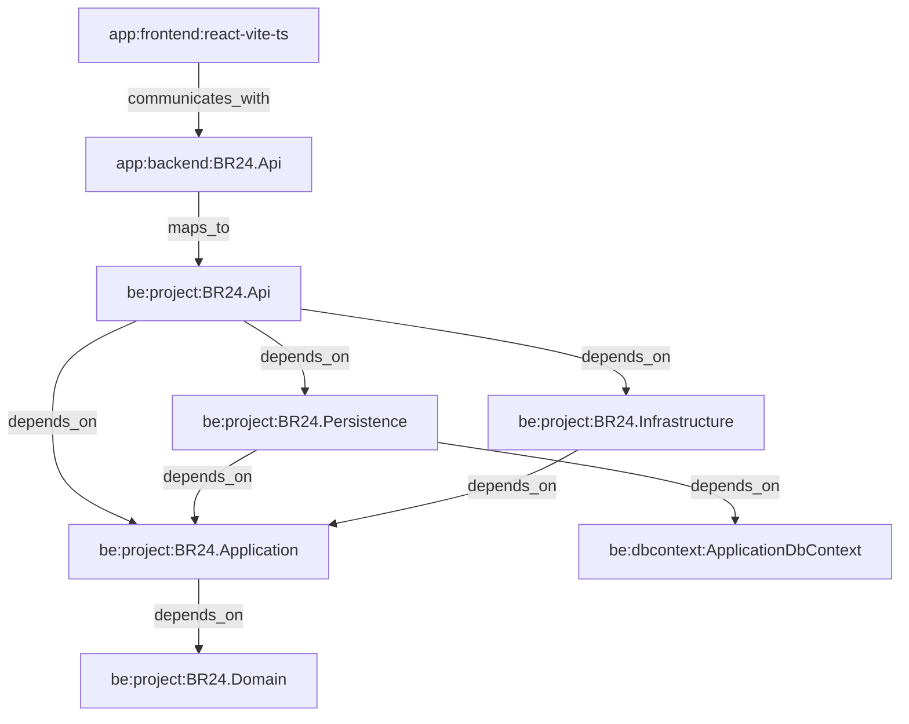
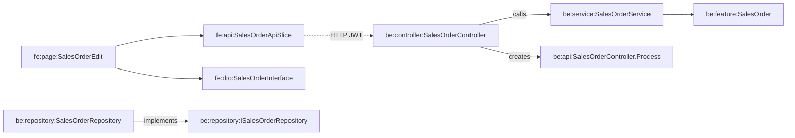

# Graphify — visual shape (readable slice)

The full Graphify store is **1,580 nodes / 2,507 edges** (mostly entities). Below is the **architecture spine** and a **SalesOrder neighborhood** — the same idea agents walk when doing impact analysis.

## Architecture spine



## SalesOrder neighborhood (example walk)



## Composition by node type

| Type | Count |
|------|------:|
| Entity | 960 |
| API | 227 |
| Repository | 116 |
| Module | 69 |
| DTO | 53 |
| Controller | 50 |
| Page | 49 |
| Service | 48 |
| Project | 5 |
| Application | 2 |
| DatabaseObject | 1 |

Raw data: [`nodes.json`](./nodes.json), [`relationships.json`](./relationships.json).

## 3D viewer

Open [`graphify-3d.html`](./graphify-3d.html) via a local HTTP server (browsers block `file://` fetch of JSON):

```bash
npx --yes serve "docs/knowledge-graph" -p 5500
```

Then visit [http://localhost:5500/graphify-3d.html](http://localhost:5500/graphify-3d.html).

Presets: Architecture · Modules · No entities · Tender neighborhood · SalesOrder neighborhood · All.

