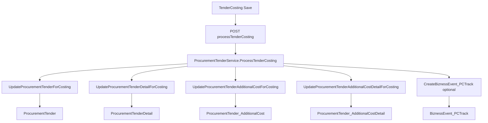

# Tender Costing — Technical & Business Record

> Record for the active page in this folder (`TenderCosting.tsx` + `CostingFormTabular.tsx`).  
> Backend root: `E:\WORKING_FOLDER\BR24\Backend\BR24_Backend`.  
> Active database (from uncommented `DefaultConnection` in `BR24.Api/appsettings.json`): **TEST_CORMSM**.

---

## 1. Overview (business purpose)

**Tender Costing** is the pricing / margin-breakdown step for a **procurement tender**. Sales or costing users:

1. Select an existing tender (by date range and optionally customer).
2. Load its line items and cost layers.
3. Adjust percentages and per-line absolute costs (LP, DP, delivery, etc.).
4. See live client-side recalculation of unit cost, tax/VAT waterfall, quoted amount, and final calculated price (including BG / PG / SD finance effects).
5. Save the breakdown back to the tender tables.
6. When opened from a **Bizness Event process chain**, saving also writes a **PC Track** progress row so the workflow can advance.

It is **not** the import/LC **CostSheet** module. Those APIs (`CostSheet*`) are a separate domain and are not called by this page.

---

## 2. User journeys

### 2.1 Menu open

| Item | Detail |
|------|--------|
| Route | `/tenderCosting` (`App.tsx`) |
| Sidebar | “Tender Costing” |
| URL params | **None** — no `tenderId` in the route |
| Dates | Defaulted to **today** on mount |
| Tender | User picks Customer + Tender No from autocompletes |

### 2.2 Process-chain / modal open

| Item | Detail |
|------|--------|
| Registration | `DynamicPageDeclaration.ts` key `TenderCosting` |
| Host | `ModalPageOpener` when card `controllerPath === 'TenderCosting'` |
| Props | `clickedCardInfo`, `operationMode` (`view` \| `edit`), `modalPageOpenerClose` |
| Auto-load | Matches `clickedCardInfo.eventNo` to tender number → loads costing |
| Tender Autocomplete | Becomes **read-only** when opened from chain |
| Save side effect | Builds `createBiznessEventPCTrackCommand` (note `Added` / `Edited`) |

Flow (both paths): **filter → select tender → load → edit → recompute (client) → save**.

---

## 3. Screen layout

Single scrollable card (no tabs), top → bottom:

1. **Header title** — `clickedCardInfo.biznessEventName` (spaced), else `"Tender Costing Breakdown"`.
2. **Filters (left)** — Date From / Date To, Customer (buyer), Sales Person (readonly after load), Tender No.
3. **Summary strip** — Quoted Amount (`totalAmountOneT`), Vat & Tax, Sales Expense, AG Expense, Delivery, Installation, Training, PIS (pre-shipment).
4. **BG / PG / SD form** — `CostingForm` (`CostingFormTabular.tsx`); no API of its own.
5. **Line-item grid** — Material React Table with nested % headers, editable cells, footers, CSV export.
6. **Actions** — Save / Close (Close calls `modalPageOpenerClose` when present).

Unused archives in this folder (not wired): `TenderCosting SupGolden*.tsx`, `CostingFormTabular GoldenV*.tsx`.

---

## 4. Calculation engine (frontend — single source of truth)

All pricing math runs in **`recomputeAll`** inside `TenderCosting.tsx`. There is **no calculate API**. Backend persists the numbers the UI sends (`CalculatedPrice`, `CalculatedProfit`, cost amounts/percentages).

Rounding: `round2` = two decimal places.

### 4.1 Editable vs derived

| Kind | Fields |
|------|--------|
| **Header % (drive recalculation)** | Tax & VAT 1/2/3, Sales Expense, AG Expense |
| **Per-row % (drive Dist/Profit)** | Dist Margin % (FOB rows only editable), Profit % (all rows) |
| **Row absolutes (kept as entered)** | LP, DP, Delivery, Installation, Pre Shipment Inspection, Training, Software (OS/Office), Hardware/ Accessories, Buffer (warranty); also Qty, FOB (`price`), Factor (`initialFactor`), Item name |
| **BG / PG / SD inputs** | BG amount; PG % / margin % / BFC % / years / per-QTC % / fixed expense; SD amount / SD % / BFC % / years |
| **Derived (virtual — stripped on save)** | Total FOB, L/C, unit cost layers, totals, BG/PG/SD per-unit, `bgAndPgAndSd`, etc. |

After load, `buildInitialStateFromDto` seeds from the API DTO then always runs `recomputeAll`.

### 4.2 Per-line pipeline (Pass 1)

For each product row:

| Step | Formula (concept) |
|------|-------------------|
| Total FOB | `qty × price` |
| Dist Margin / product | FOB rows: `price × (row distMarginPercent / 100)`; non-FOB: kept from saved Cost |
| L/C | `(price + distMarginPerProduct) × initialFactor` |
| Profit / product | `(L/C + LP) × (row profitPercent / 100)` |
| Unit Cost | `L/C + LP + DP + Profit` |
| Unit Price (no V&T + others) | Unit Cost + Delivery + Installation + PSI + Training + Software + Hardware + Buffer |
| Tax & VAT 1 | that unit price × `(taxAndVATOneP / 100)` |
| Unit Price with V&T | unit price + Tax&VAT1 |
| Sales Expense | unit-with-VT × `(salesExpenseP / 100)` |
| Unit Price with SE | unit-with-VT + SE |
| AG Expense | unit-with-SE × `(agExpenseP / 100)` |
| Unit Price with AG | unit-with-SE + AG |
| Tax & VAT 2 | `(AG + SE) × (taxAndVATTwoP / 100)` |
| Unit Price (TV2+SE+AG) | unit-with-AG + Tax&VAT2 |
| Total Amount One (row) | `qty × unitPriceWithTv2SeAg` |
| Total Vat & Tax (row) | `(Tax&VAT1 + Tax&VAT2) × qty` |

Header totals (`*T`, `totalAmountOneT`, …) are sums of the per-row values (note: many “other cost” totals sum per-unit amounts, not qty-scaled).

### 4.3 BG / PG / SD (header, after Pass 1)

Uses `sumOfUnit` and `totalAmountOneT`:

| Block | Key formulas |
|-------|----------------|
| **BG** | `bgValuePerUnit = bgAmount / sumOfUnit` |
| **PG** | `performanceGuaranteeA = (performanceGuaranteeP/100) × totalAmountOneT` → margin amount → bank finance charge × years; quarterly charges from `pgPerQtChargeP`; `pgTotalQuarter = pgTotalYears × 4 + 1`; fixed expense folded in → `pgValuePerUnit` |
| **SD** | `securityDepositA = (securityDepositP/100) × securityDeposit` → BFC × years → `sdValuePerUnit` |
| **Combined** | `bgAndPgAndSd = bgValuePerUnit + pgValuePerUnit + sdValuePerUnit` |

### 4.4 Pass 2 (final price)

| Step | Formula |
|------|---------|
| Tax & VAT 3 / product | `bgAndPgAndSd × (taxAndVATThreeP / 100)` |
| Calculated Price | `unitPriceWithTv2SeAg + bgAndPgAndSd + taxAndVATThree` |
| Total Amount Two (row) | `qty × calculatedPrice` |
| Calculated Profit (row) | `qty × profitPerProduct` |

---

## 5. API reference

Base: `{API_BASE_URL}/ProcurementTender/...`  
Frontend wiring: `src/infrastructure/api/TenderApiSlice.ts`, types in `src/domain/interfaces/TenderCostingInterface.ts`.  
Auth: RTK uses JWT helper; axios combo calls use `Bearer` from `localStorage.userInfo`. No debounce.

| When | Client | Method | Endpoint | Purpose |
|------|--------|--------|----------|---------|
| Mount + Customer focus | axios | GET | `getBuyersOfTenderByDateFromDateToTenderNo?dateFrom&dateTo&tenderNo` | Buyer options |
| Mount + Tender focus | axios | GET | `getTenderInfoByTenderNoBuyerIdDateFromDateTo?dateFrom&dateTo&buyerId` | Tender options |
| Tender select / chain auto | RTK lazy query | GET | `getTenderCosting?tenderId=` | Load costing (**may INSERT seed rows**) |
| Save | RTK mutation | POST | `processTenderCosting` | Persist + optional PC Track |

### 5.1 Save body (`TenderCostingCommandsVM`)

```ts
{
  tenderCostingData: GetTenderCostingDto, // virtual fields stripped
  createBiznessEventPCTrackCommand: ICreateBiznessEventPCTrackCommand | null
  // non-null only if clickedCardInfo.biznessEventProcessConfigurationId is set
}
```

PC Track fields when from chain: `eventNo`, `performedBy` (security user), `startDate`/`endDate`, `note` (`Added`|`Edited`), `progressPReported: 100`, `originalSequence` / `nextSequence`, `complete: false`, `biznessEventProcessConfigurationId`, `firstEventNo`, `locationId`.

### 5.2 Lookup queries (tables)

| Endpoint | Tables | Filters |
|----------|--------|---------|
| Buyers | `Buyer` ⋈ `ProcurementTender` | Optional `TenderNo`; `TenderEntryDate` between dateFrom/dateTo |
| Tenders | `ProcurementTender` | Optional `BuyerId`; same date filter on `TenderEntryDate` |

Returned tender combo fields used by UI: `procurementTenderId`, `tenderNo`, `remarks`, `tenderWon` (plus any extra buyer/date fields if present on the payload).

---

## 6. Backend architecture

**Controller:** `BR24.Api/Controllers/ProcurementTenderController.cs`  
Route prefix: `api/ProcurementTender`  
Service: `ProcurementTenderService` (`TransactionScope` + MediatR).  
Repository read for DTO: `ProcurementTenderRepository.GetTenderCosting`.

Both costing actions are marked `[AllowAnonymous]` on the controller (document only; do not change here).

### 6.1 GET `getTenderCosting` — seed then read

```
Controller
 → ProcurementTenderService.GetTenderCosting
    1. InsertMissingTenderAdditionalCostCommand
       → INSERT any missing of 16 named rows (Percentage=0, Amount=0, Type="A", Sequence=index+1)
    2. InsertMissingTenderAdditionalCostDetailCommand
       → INSERT missing (AdditionalCostId × ProcurementTenderDetailId) with Cost=0
    3. GetTenderCostingQuery → repository EF SELECT into GetTenderCostingDto
 → SaveChanges + Complete
```

**Important:** Loading costing is **not a pure read**. First open for a tender (or after new lines) can create scaffolding rows.

### 6.2 POST `processTenderCosting` — updates (+ optional track)



- No stored procedures on this path.
- No backend recompute of the tax/price waterfall.
- Does **not** change `TenderWon` or other tender “status” flags.
- `CreateProcurementTenderAdditionalCostDetailForCosting` exists but is **commented out** on save; seeding is on GET.

---

## 7. Data model

### 7.1 Tables

| SQL table | Role in Tender Costing |
|-----------|------------------------|
| `ProcurementTender` | Header: identity, buyer, salesperson, dates, **BG/PG/SD fields** |
| `ProcurementTenderDetail` | Lines: product, qty, FOB price, factor, **CalculatedPrice / CalculatedProfit / CalculatedTAXVATAmount** |
| `ProcurementTender_AdditionalCost` | One row per named cost type per tender (`Name`, `Percentage`, `Amount`) |
| `ProcurementTender_AdditionalCostDetail` | Per line × cost type: `Cost` |
| `Buyer` | Buyer name (read) |
| `Employee` | Sales person name (read) |
| `Product` | Product name (read) |
| `BiznessEvent_PCTrack` | Workflow progress INSERT on chain save |

Entity attributes: `[Table("...")]` on the corresponding domain classes under `BR24.Domain/Entities`.

### 7.2 `ProcurementTender` fields updated on save

`BGAmount`, `PerformanceGuaranteeP`, `PerformanceGuaranteeA`, `PGMarginP`, `PGMarginAmount`, `PGBankFinanceChargeP`, `PGTotalYears`, `PGPerQtChargeP`, `PGTotalQuarter`, `PGFixedExpense`, `SecurityDepositP`, `SecurityDeposit`, `SDBankFinanceChargeP`, `SDTotalYears`.

### 7.3 `ProcurementTenderDetail` fields updated on save

`Quantity`, `Price`, `InitialFactor`, `CalculatedPrice`, `CalculatedProfit`, `CalculatedTAXVATAmount`.

### 7.4 Named additional-cost catalog (exact `Name` strings)

Used as keys for both header P/T and per-product detail costs:

1. Dist Margin  
2. LP  
3. Profit  
4. DP  
5. Delivery  
6. Installation  
7. Pre Shipment Inspection  
8. Training  
9. Software (OS/Office)  
10. Hardware/ Accessories  
11. Buffer (warranty)  
12. Tax & VAT 1  
13. Sales Expense  
14. AG Expense  
15. Tax & VAT 2  
16. Tax & VAT 3  

### 7.5 How costs are stored vs displayed

- **Header % / totals** live on `ProcurementTender_AdditionalCost` (`Percentage`, `Amount`) keyed by `Name`.
- **Per-product amounts** live on `ProcurementTender_AdditionalCostDetail.Cost`, joined via `ProcurementTenderAdditionalCostId` + `ProcurementTenderDetailId`.
- **Final quote figures** also denormalized onto the detail row as `Calculated*`.

---

## 8. Process tracking (Bizness Event)

When save runs from a process card (`biznessEventProcessConfigurationId` present):

1. Frontend attaches `createBiznessEventPCTrackCommand`.
2. Service: if `OriginalSequence == 1`, sets `FirstEventNo = EventNo`.
3. `CreateBiznessEvent_PCTrackCommandHandler` may adjust `Complete` / `NextSequence` from max sequence of the process config, and for tender event numbers may adjust `ProgressPReported` based on product visit coverage.
4. **INSERT** into `BiznessEvent_PCTrack`.

Operational meaning: completing Tender Costing records that the process step was performed (and can unlock / progress the next sequence in the SA/event UI).

---

## 9. Constraints & notes (for future requirements)

1. **GET has write side effects** — auto-seeds the 16 cost names and detail grid cells. Loading a tender can mutate the DB.
2. **Save is update-only** for additional costs/details — it assumes scaffolding already exists (normally created by GET). Missing names are skipped / can throw if no cost rows at all.
3. **Name matching inconsistency** — seed “missing” detection uses case-insensitive compare; update handlers match `Name` with **exact** equality. Renaming or case drift can break updates.
4. **Calculations live on the frontend** — changing formulas requires UI (`recomputeAll`) changes; backend will happily store whatever is posted.
5. **CostSheet ≠ Tender Costing** — do not reuse import/LC CostSheet tables or APIs for this screen.
6. **No calculate endpoint / no debounce** on lookups.
7. **Auth quirk** — costing GET/POST are `[AllowAnonymous]` on the API controller (frontend still sends tokens for axios/RTK in practice).
8. Golden backup TSX files in this folder are historical only.
9. **ProductSource drives FOB vs LP (frontend)** — API should return `productSource` per detail (`FOB` / `LOCAL` / `STOCK`).  
   - `FOB`: Price in FOB column (editable); LP read-only; save `Price` from FOB.  
   - `LOCAL`/`STOCK`: Price shown as LP (editable); FOB empty/read-only; save `Price` = LP and LP AdditionalCost as usual.  
   - Else: FOB+LP read-only; save keeps loaded `Price` unchanged.  
   Backend save handlers need no ProductSource field updates.
10. **Per-row Dist Margin & Profit %** — header % inputs removed. Each row has Dist Margin % / Dist Margin value and Profit % / Profit value. Only % is editable; values are formula-derived (`price×%` for Dist on FOB rows; `(L/C+LP)×%` for Profit). Dist Margin % editable only when `productSource === "FOB"`; Profit % editable on all rows. Footers sum row % and row values. Persist via existing detail `Cost` + header `Percentage`/`Amount` (header P = sum of row %).

---

## 10. Key file index

| Layer | Path |
|-------|------|
| Page | `src/presentation/pages/TenderCosting/TenderCosting.tsx` |
| BG/PG/SD UI | `src/presentation/pages/TenderCosting/CostingFormTabular.tsx` |
| DTO / VM types | `src/domain/interfaces/TenderCostingInterface.ts` |
| RTK API | `src/infrastructure/api/TenderApiSlice.ts` |
| Dynamic open | `src/presentation/Utils/DynamicPageDeclaration.ts` |
| Controller | `BR24.Api/Controllers/ProcurementTenderController.cs` |
| Orchestration | `BR24.Application/.../ProcurementTenderService.cs` |
| Read query | `.../Queries/GetTenderCosting/*` + `ProcurementTenderRepository.GetTenderCosting` |
| Seed on load | `InsertMissingTenderAdditionalCost*` / `InsertMissingTenderAdditionalCostDetail*` |
| Save handlers | `UpdateProcurementTender*ForCosting*` |
| PC Track | `CreateBiznessEvent_PCTrackCommand` |

---

*End of record. Use this document as the baseline when specifying new Tender Costing requirements.*
